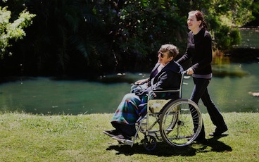
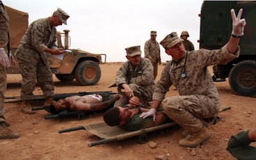
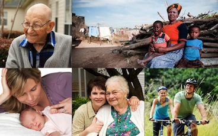



	
	

	  <!-- Carousel items -->
	  

		

			

				<h2>What if...</h2>
				You could watch over a loved one from anywhere in the world?
				"I'd know my mom's caregiver has up to the moment info and can respond quickly, any time of day."
			

				
			

			    
			

	    

		

			

				<h2>What if...</h2>
				You could get a call 24/7 if a loved one got sick, fell or had a major health event?
				"I'd worry less while traveling since I'd get an alert—any time, anywhere."
			

				
			

			    
			

	    

		

			

				<h2>What if...</h2>
				You could track your bio-rhythms, caloric burn and athletic conditioning?
				"I'd see if I'm hitting my goals, and track progress with friends."
			

				
			

			    
			

	    

		

			

				<h2>What if...</h2>
				We could monitor chronic disease, reduce hospital stays and re-admissions? 
				"Improving those metrics would help my hospital meet financial goals, control costs and ultimately provide better care."
			

				
			

			    
			

	    

		

			

				<h2>What if...</h2>
				You could watch over soldiers' vital signs in the field?
				"We'd know when a soldier was in trauma and needed help."
			

				
			

			    
			

	    

		

			

				<h2>What if...</h2>
				You could have real-time continuous wireless monitoring of injured soldiers? 
				"We'd be able to react immediately upon a critical change of condition, prioritize evac and save lives."
			

				
			

			    
			

	    

		

			

				<h2>What if...</h2>
				We could bring leading edge 1st World solutions to Developing Nations inexpensively? 
			

				
			

			    
			

	    

		
		

			

				<h2>Vital Connect Can!</h2>
				Vital Connect wants to solve all of these problems at an affordable cost. 
			

				
			

			    
			

	    

		
		
	
	  

	  <!-- Carousel nav
	  <a class="carousel-control left" href="#myCarousel" data-Slide="prev">&lsaquo;</a>
	  <a class="carousel-control right" href="#myCarousel" data-Slide="next">&rsaquo;</a>
	  -->
	
 <!-- end of whatif -->

	

		<h1>Vital Connect brings to you an innovative device.</h1> 
		<h6>It's easy to use, it's unobtrusive, it looks familiar and it leverages a known usage pattern.</h6>
	

	

		
		
Wireless Communication

	

	

		
		
Cloud Analytics

	

	

		
		
HIPAA Compliant

	

	

		
		
Bio-Rhythmic Monitoring

	

	

		
		
Fall Monitoring

	

	

		
		
Medical Services

	

  <h2>Company</h2>
   
Vital Connect Inc. is a technology startup founded in 2011 with the goal to develop the newest generation of technologies to help address some of the most challenging issues in the health care industry today. Vital Connect's products will improve the quality of life for individuals of all ages. 

  
<a class="btn" href="#">View details &raquo;</a>

  <h2>Mission</h2>
   
Vital Connect's mission is to improve the quality of life for young and old through the use of state-of-art silicon, software, and packaging solutions. The company is dedicated to innovation, quality, customer focus, team work and integrity, in order to ensure its products are well-designed for the new millennium. 

  
<a class="btn" href="#">View details &raquo;</a>

  

